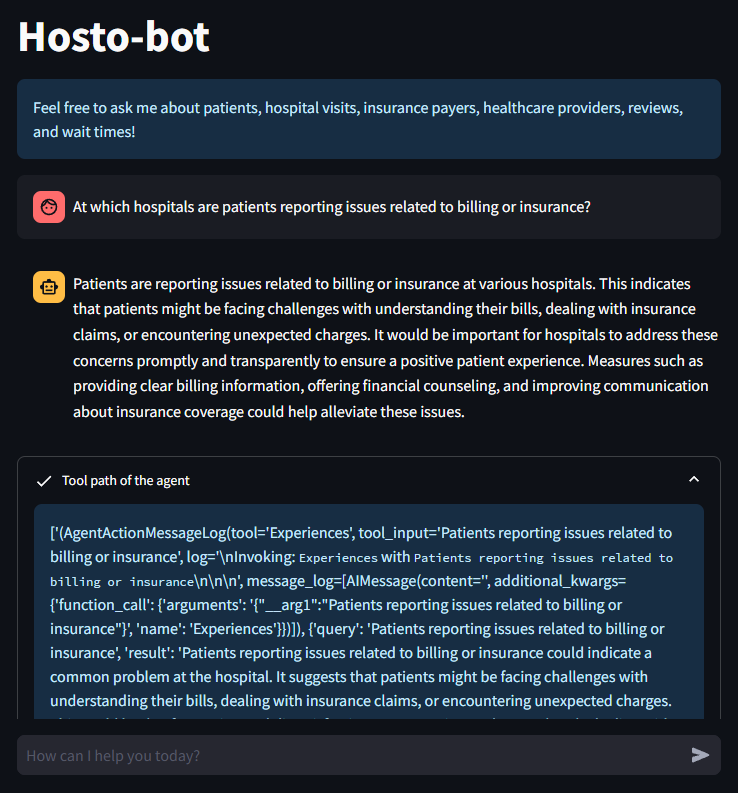

# 🏥 LLM RAG ETL Showcase: Hosto-bot

Hosto-bot is an advanced **Agentic Microservices** demonstration combining **Large Language Models (LLMs)** with a **Graph Database (Neo4j)** to deliver a powerful **Hybrid RAG (Retrieval-Augmented Generation)** system.

Traditional RAG systems often struggle with structured aggregation and relationship-heavy queries. Hosto-bot addresses this limitation using a **Router Agent** that dynamically selects the best tool:

- 🔎 **Vector Search** → qualitative insights (patient sentiment)
- 🧠 **Graph Cypher Generation** → quantitative analytics
- ⚙️ **Python Tools** → real-time simulations and computations


---

## 🎯 Project Goals & Context

Healthcare data is inherently fragmented:

- **Structured Data**: billing, visits, hospitals  
- **Unstructured Data**: patient reviews  
- **Real-time Data**: ER wait times, bed availability  

Hosto-bot provides a **unified natural language interface** allowing users (administrators, patients) to query across all data types without needing SQL, Cypher, or Python.

---

## 🏗️ System Architecture

The system follows a **decoupled microservices architecture**.

### 1. Data Layer – ETL Engine (`/hospital_neo4j_etl`)

Responsible for building the data foundation:

- **Data ingestion**: loads 6 datasets (Hospitals, Payers, Physicians, Patients, Visits, Reviews)
- **Graph construction**:
  - Enforces uniqueness constraints
  - Builds relationships (e.g. `(:Physician)-[:TREATS]->(:Visit)`)
- **Vectorization**:
  - Creates Neo4j vector index on `Review` nodes
  - Uses OpenAI embeddings for semantic search
- **Resilience**:
  - Retry mechanism to handle startup delays

---

### 2. Logic Layer – Agentic API (`/chatbot_api`)

Core intelligence built with **FastAPI + LangChain**.

- **Router Agent**:
  - Uses `create_openai_functions_agent`
  - Selects optimal tool based on intent

- **Hybrid Querying**:
  - Graph Tool → dynamic Cypher queries  
  - Experiences Tool → vector similarity search  
  - Wait-Time Tool → Python-based simulation (NumPy)

- **Error Handling**:
  - Async retry decorator for API reliability

---

### 3. Presentation Layer – Chatbot UI (`/chatbot_frontend`)

Built with **Streamlit**.

- Maintains **session state**
- Displays **chat history**
- Provides **full transparency**:
  - Shows tool selection
  - Displays generated queries and reasoning

---

## 📂 Project Structure

```plaintext
LLM_RAG_ETL_Showcase-Hostobot/
├── .env                        # Critical environment configurations
├── docker-compose.yml          # Orchestration for all 3 services
├── requirements.txt            # Root dependencies (mostly for local dev)
│
├── img/                        # Images to display in the Readme
│   ├── interface.png
│   ├── dbscheme.png
│
├── hospital_neo4j_etl/         # DATA LAYER
│   ├── src/
│   │   ├── hospital_bulk_csv_write.py  # Bulk loader & relationship mapper
│   │   └── entrypoint.sh               # Execution script
│   └── Dockerfile
│
├── chatbot_api/                # LOGIC LAYER (FastAPI)
│   ├── src/
│   │   ├── main.py                     # API entry point & routes
│   │   ├── agents/
│   │   │   └── hospital_rag_agent.py   # ReAct Agent & Tool definitions
│   │   ├── chains/
│   │   │   ├── hospital_cypher_chain.py # Cypher generation logic
│   │   │   └── hospital_review_chain.py # Vector search logic
│   │   ├── tools/
│   │   │   └── wait_times.py            # Simulated real-time tool
│   │   ├── models/
│   │   │   └── hospital_rag_query.py    # Pydantic schemas
│   │   └── utils/
│   │       └── async_utils.py          # Retry decorators
│   └── Dockerfile
│
└── chatbot_frontend/           # PRESENTATION LAYER
    ├── src/
    │   └── main.py                     # Streamlit UI logic
    └── Dockerfile
```

## 📊 Knowledge Graph Schema

The Neo4j database is modeled to handle multi-hop questions.

### Nodes

- **Hospital**: `{id, name, state_name}`
- **Payer**: `{id, name}`
- **Physician**: `{id, name, dob, school, salary}`
- **Patient**: `{id, name, sex, blood_type}`
- **Visit**: `{id, room_number, admission_type, status, diagnosis}`
- **Review**: `{id, text, patient_name, physician_name}`

### Relationships

- `(Patient)-[:HAS]->(Visit)`
- `(Physician)-[:TREATS]->(Visit)`
- `(Visit)-[:AT]->(Hospital)`
- `(Visit)-[:COVERED_BY]->(Payer)`
- `(Visit)-[:WRITES]->(Review)`
- `(Hospital)-[:EMPLOYS]->(Physician)`


---

## 🚀 Installation & Deployment

### 1. Configuration

Create a `.env` file in the root directory:

```bash
# API Keys
OPENAI_API_KEY=sk-...

# Neo4j Database (AuraDB or Local)
NEO4J_URI=neo4j+s://...
NEO4J_USERNAME=neo4j
NEO4J_PASSWORD=...
NEO4J_DATABASE=neo4j

# Data Source URLs
HOSPITALS_CSV_PATH=https://.../hospitals.csv
# ... (Fill in paths for Payers, Physicians, Patients, Visits, Reviews)

# Model Settings
HOSPITAL_AGENT_MODEL=gpt-3.5-turbo-1106
HOSPITAL_CYPHER_MODEL=gpt-3.5-turbo-1106
HOSPITAL_QA_MODEL=gpt-3.5-turbo-0125

# Internal Networking
CHATBOT_URL=http://chatbot_api:8000/hospital-rag-agent

### 2. Launch with Docker

Ensure Docker Desktop is running, then execute:

```bash
docker-compose up --build
```

This command builds the images and starts the containers in the correct order:

- ETL  
- API  
- Frontend  

---

### 3. Usage

- **Frontend UI**: http://localhost:8501  
- **API Documentation**: http://localhost:8000/docs  

---

## 🛠️ Tech Stack

- **Language**: Python 3.11+  
- **Graph Database**: Neo4j (Cypher)  
- **LLM Orchestration**: LangChain  
- **LLM Provider**: OpenAI GPT-3.5 / GPT-4  
- **Backend**: FastAPI (Asynchronous)  
- **Frontend**: Streamlit  
- **Containerization**: Docker & Docker Compose  

---

## 💬 Sample Queries

| Type         | Query                                                                 |
|--------------|----------------------------------------------------------------------|
| Quantitative | "What was the total amount billed to each payer during 2023?"        |
| Qualitative  | "How are patients describing the nursing team at Castaneda-Hardy?"   |
| Real-time    | "What’s the current wait time at Wallace-Hamilton Hospital?"         |
| Comparative  | "Which doctor has the shortest average visit duration?"              |

Which hospitals are part of the hospital network?
What’s the current wait time at Wallace-Hamilton Hospital?
At which hospitals are patients reporting issues related to billing or insurance?
What’s the average length in days for completed emergency visits?
How are patients describing the nursing team at Castaneda-Hardy?
What was the total amount billed to each payer during 2023?
What is the average charge for visits covered by Medicaid?
Which doctor has the shortest average visit duration?
What is the total billed amount for patient 789's hospital stay?
Which state saw the biggest percentage increase in Medicaid visits from 2022 to 2023?
What’s the average daily billing amount for patients with Aetna coverage?
How many patient reviews have been submitted from Florida?
For visits that include a chief complaint, what percentage also have a review?
What percentage of visits at each hospital include patient reviews?
Which physician has received the highest number of reviews for their visits?
What is the unique identifier for Dr. James Cooper?
Show all reviews associated with visits handled by physician 270 — include every one.
